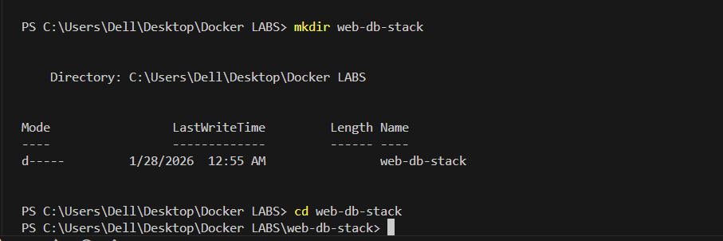

# Lab 07: Docker Compose for a Web + DB Stack

## What You Will Learn
- How to use Docker Compose to run a web server and a database together with one command.
- How to keep your database data safe using Docker volumes.
- How to write and understand a docker-compose.yml file.
- How to check if your data is still there after restarting containers.

---

## Key Concepts (Explained Simply)
- **Docker Compose:** Lets you start many containers at once with one file.
- **Services:** Each part (web or db) is called a service.
- **Volumes:** A way to save your database data so it doesn't get lost.
- **depends_on:** Makes sure the database starts before the web server.
- **Environment Variables:** Settings you give to containers (like the database password).

---

## Step-by-Step Solution

### 1. Check Docker and Docker Compose
```
docker --version
```

```
docker-compose --version
```

### 2. Make the Project Folder
```
mkdir web-db-stack && cd web-db-stack
```

### 3. Make the docker-compose.yml File
```
notepad docker-compose.yml
```


(Paste the YAML content below into it.)

### 4. Add the Services
```yaml
version: '3.8'

services:
  web:
    image: nginx:latest
    ports:
      - "80:80"
    depends_on:
      - db

  db:
    image: mysql:5.7
    environment:
      MYSQL_ROOT_PASSWORD: examplepassword
      MYSQL_DATABASE: exampledb
    volumes:
      - db_data:/var/lib/mysql

volumes:
  db_data:
```

### 5. Start Everything
```
docker-compose up -d
```


### 6. Check if They Are Running
```
docker-compose ps
```

Open your browser and go to http://localhost to see the nginx welcome page.

### 7. Test the Database
```
docker-compose exec db mysql -u root -p
```

(Type the password: examplepassword)
```
SHOW DATABASES;
```

(You should see exampledb in the list.)

### 8. Stop and Clean Up
```
docker-compose down
```


### 9. Check if Database Data is Safe
- Start the containers again:
```
docker-compose up -d
```

- Connect to MySQL and check if your data is still there:
```
docker-compose exec db mysql -u root -p
```

(Type the password: examplepassword)
```
SHOW DATABASES;
```
(If your database is still there, your data is safe!)

---

## What Each Command Does (Easy Words)
- `docker --version`: Shows if Docker is installed.
- `docker-compose --version`: Shows if Docker Compose is installed.
- `mkdir web-db-stack && cd web-db-stack`: Makes a new folder and goes into it.
- `notepad docker-compose.yml`: Opens a new file for your setup.
- `docker-compose up -d`: Starts all your containers in the background.
- `docker-compose ps`: Shows which containers are running.
- `docker-compose exec db mysql -u root -p`: Lets you use MySQL inside the db container.
- `SHOW DATABASES;`: Lists all databases in MySQL.
- `docker-compose down`: Stops and removes your containers.

---

## What I Learned
- How to use Docker Compose to run a web server and a database together.
- How to keep database data safe using volumes.
- How to check if data is still there after restarting containers.
- How to explain each step and command in easy words.

---

## Conclusion
You learned how to use Docker Compose to run a web server and a database together, keep your data safe, and manage everything with simple commands!
